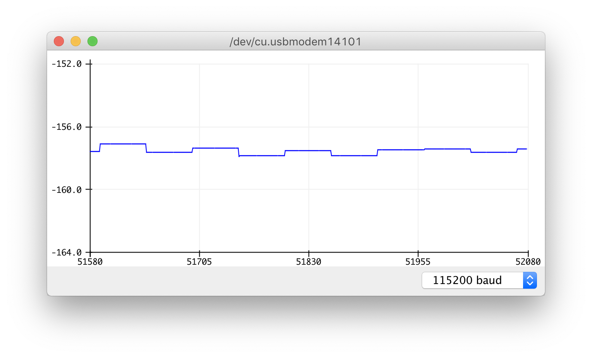
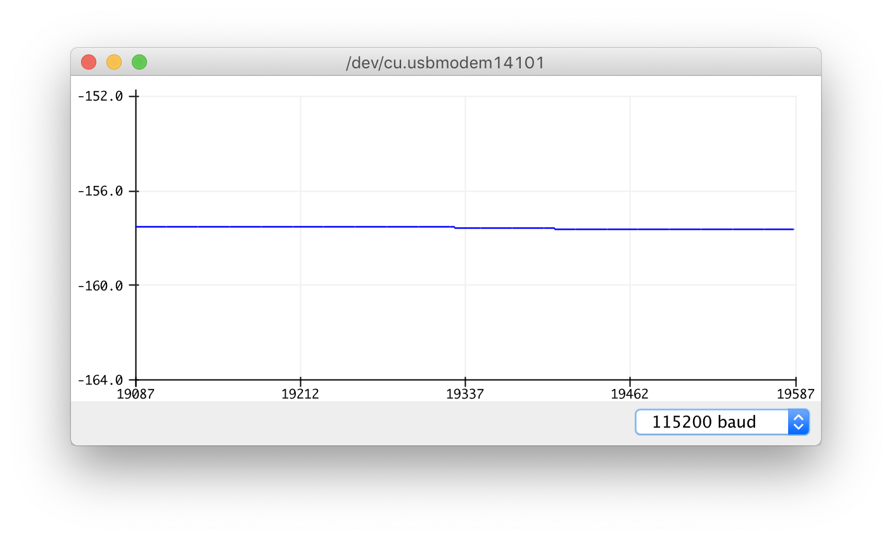

An exploration of the Pololu altimu-10 v4.

The altitude/pressure readings are noisy, so I've applied a Kalman filter to smooth out the noise.

Depends on these Ardunio libraries:
- https://github.com/pololu/lps-arduino
- https://github.com/denyssene/SimpleKalmanFilter

Open up the Serial monitor to view the filtered altitude

## Before

## After

